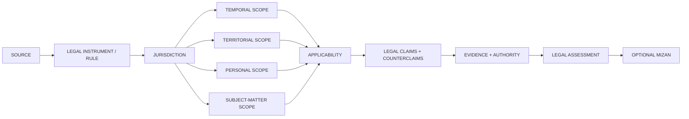
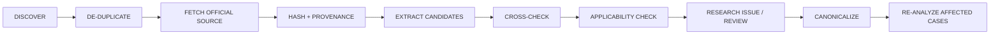

<div align="center">

# AWS

## ANGEL WITH SHOTGUN

### **TRACE THE LAW.**

#### APPLICABILITY · JURISDICTION · AUTHORITY · UNCERTAINTY

A provenance-first **International Law & Regulation Intelligence** repository for reconstructing applicable law, jurisdiction, legal status, competing arguments, uncertainty, and explainable Mizan analysis.

**MOONWITNESS · ROCKSOUL RESEARCH · STORY × EVENT × PERSON × TEXT × LAW**

<br/>

[](https://github.com/bjo163/rocksoul-aws/actions/workflows/aws-legal-corpus.yml)


<br/>

[Architecture](#legal-intelligence-graph) · [Source model](#research-source-model) · [Machine contracts](#canonical-machine-contracts) · [Documentation](#documentation)

</div>

---

> **Evidence can tell us what happened. Law asks something else.**

A legal text can exist without applying to a case.  
A State can sign without ratifying.  
A rule can bind one actor without binding every actor.  
A judgment can interpret law without becoming a universal statute.  
A disputed legal position is not automatically false.  
A legal conclusion is not the same thing as a Mizan assessment.

That separation is the foundation of AWS.

## Core question

```text
WHAT conduct is being evaluated?
WHO are the relevant actors?
WHEN and WHERE did it occur?
WHICH legal system / forum can govern it?
WHICH instrument or rule was in force?
WHO was bound by it?
WHAT exceptions, reservations, declarations, or competing rules matter?
WHAT evidence supports each legal proposition?
WHAT remains disputed or unresolved?
```

## Golden rule

### **LEGAL TEXT ≠ APPLICABLE LAW**

## Legal intelligence graph



<div align="center">

### **LEGALITY ≠ MORALITY · JURISDICTION ≠ MERITS**

</div>

## MoonWitness / Rocksoul research map

| Repository | Domain | Core question | Mantra |
|---|---|---|---|
| [`rocksoul-mftl`](https://github.com/bjo163/rocksoul-mftl) | STORY | What was told? | TRACE THE STORY. |
| [`rocksoul-legend`](https://github.com/bjo163/rocksoul-legend) | EVENT | What happened? | TRACE THE EVENT. |
| [`rocksoul-superhero`](https://github.com/bjo163/rocksoul-superhero) | PERSON | Who was involved? | TRACE THE PERSON. |
| [`rocksoul-rgbl`](https://github.com/bjo163/rocksoul-rgbl) | TEXT | What does the exact text say? | TRACE THE TEXT. |
| **`rocksoul-aws`** | LAW | Was it allowed? | TRACE THE LAW. |

AWS consumes cross-repository references. It does **not** duplicate canonical STORY, EVENT, PERSON, or TEXT objects.

[Read the interoperability contract →](docs/ROCKSOUL_INTEROP.md)

## Legal-result vocabulary

AWS does not reduce international law to one opaque score.

```text
PERMITTED
RESTRICTED
PROHIBITED
DISPUTED
UNRESOLVED
```

Applicability is tracked separately:

```text
APPLICABLE
NOT_APPLICABLE
PARTIALLY_APPLICABLE
UNCERTAIN
```

A result must preserve the legal basis, jurisdiction, source, evidence, contrary authority, time/place scope, confidence, and unresolved questions that produced it.

## Research source model

AWS prioritizes retrievable, attributable legal material:

1. official treaty/depositary text and status;
2. constitutive instruments and official legal databases;
3. judgments, orders, and advisory opinions of competent international tribunals;
4. official treaty-body, monitoring, implementation, and institutional material;
5. official State material when legally relevant;
6. high-quality scholarship as secondary analysis, never silently promoted into primary authority.

**No generated citation becomes canonical merely because an AI produced it.**

[Read the research model →](docs/LEGAL_RESEARCH_MODEL.md)

## Automatic research, bounded conclusions

AWS is designed to grow continuously, but automation is **research-first, never auto-verdict**.



Treaty actions, reservations, declarations, withdrawals, new judgments, corrigenda, supersession, and source changes may trigger re-analysis. They must never silently rewrite historical research.

[Read the automation contract →](docs/AUTOMATION.md)

## Canonical machine contracts

The legal-domain contracts in `schemas/` include:

```text
legal-source         legal-instrument      jurisdiction
 treaty-action        applicability         legal-claim
 legal-assessment     cross-repo-case       foreign-reference
 cross-repo-graph     repository-binding    research-review-item
 reanalysis-candidate revision-diff         research-run
 source-freshness     source-monitor
```

Stable identifier families include:

```text
LAW-...     JUR-...     TACT-...    APPL-...
LCLAIM-...  LASSMT-...  XREF-...    CGRAPH-...
GEDGE-...   RRUN-AWS-... RDIFF-AWS-... RCAND-AWS-...
RVIEW-AWS-... FRESH-AWS-...
```

Runtime SQL tables, search indexes, embeddings, caches, and derived scores are rebuildable implementation artifacts. Canonical research remains provenance-bearing data.

## Research guardrails

**SIGNATURE ≠ RATIFICATION.**  
**RATIFICATION ≠ UNIVERSAL APPLICABILITY.**  
**JURISDICTION ≠ MERITS.**  
**RESOLUTION ≠ TREATY.**  
**TEXTUAL PRESENCE ≠ LEGAL FORCE.**  
**LEGALITY ≠ MORAL GOODNESS.**  
**MIZAN ≠ COURT JUDGMENT.**  
**DISPUTED ≠ FALSE.**  
**MISSING ≠ PERMITTED.**  
**MISSING ≠ PROHIBITED.**  
**UNCERTAINTY IS DATA.**

This is a research and analysis system, not a substitute for case-specific professional legal advice.

## MoonWitness / UI boundary

The UI and visual design source of truth remains **`rocksoul-assets`**, including the public STORY / EVENT / PERSON / RGBL / AWS navigation and legal-analysis screens.

AWS owns machine contracts, research data, ingestion, legal analysis, and APIs. It does not become the design-source repository.

## Branch model

```text
main   ← stable / release
dev    ← all development
```

No other remote branches are part of the repository contract. Development lands directly in `dev`; release promotion is only `dev → main`. Release automation may create tags/releases, never release branches.

[Read the canonical branching contract →](docs/BRANCHING.md)

## Current repository state

This repository was created from a mature MoonWitness/Cosmic-derived engine codebase. That inherited code remains useful technical substrate—persistence, orchestration, evidence, Mizan, review, audit, and API infrastructure—but old **Cosmic** naming and astronomy/revelation-specific surfaces are **not** the canonical AWS domain definition.

```text
PHASE 0  DOMAIN CONTRACT                   ✓
PHASE 1  LEGAL CORPUS PROOF                ✓
PHASE 2  PERSISTENCE + SOURCE WORKER       ✓
PHASE 3  OFFICIAL-SOURCE INGESTION         ✓
PHASE 4  APPLICABILITY ENGINE              ✓
PHASE 5  HOLDING-LEVEL LEGAL ASSESSMENT    ✓
PHASE 6  CROSS-REPO CASE GRAPH             ✓
PHASE 7  CONTINUOUS RESEARCH / RE-ANALYSIS ✓
```

Do not bulk-rename or delete inherited engine packages until their replacement/retention role is explicit and tested.

## Repository atlas

```text
rocksoul-aws/
├── data/aws/        canonical legal research data
├── docs/            legal method, phases, cases, interoperability
├── packages/        runtime, API, persistence and analysis engine
├── schemas/         legal-domain machine contracts
├── scripts/         validation, research and maintenance tooling
└── .github/         corpus, branch, certification and release workflows
```

## Documentation

| Document | Purpose |
|---|---|
| [Documentation index](docs/README.md) | Entry point to AWS documentation |
| [Branching contract](docs/BRANCHING.md) | `main` / `dev` lifecycle |
| [Legal research model](docs/LEGAL_RESEARCH_MODEL.md) | Source authority and uncertainty model |
| [Rocksoul interoperability](docs/ROCKSOUL_INTEROP.md) | Five-domain ownership contract |
| [Automation & freshness](docs/AUTOMATION.md) | Continuous research contract |
| [Canonical legal data](data/aws/README.md) | Canonical AWS data layout |
| [Jerusalem five-way case](docs/cases/JERUSALEM-70-FIVE-WAY.md) | Cross-domain proof case |
| [ICJ Case 91](docs/cases/BOSNIA-SERBIA-ICJ-91.md) | Modern golden legal case |
| [Phase 7](docs/AWS-PHASE-7-CONTINUOUS-RESEARCH.md) | Continuous research and targeted re-analysis |

---

<div align="center">

## **ANGEL WITH SHOTGUN**

### **EVIDENCE FINDS THE LINE. LAW ASKS IF SOMEONE CROSSED IT.**

**TRACE · VERIFY · APPLY · ARGUE · WEIGH**

`AWS / MoonWitness · Rocksoul Research`

</div>
