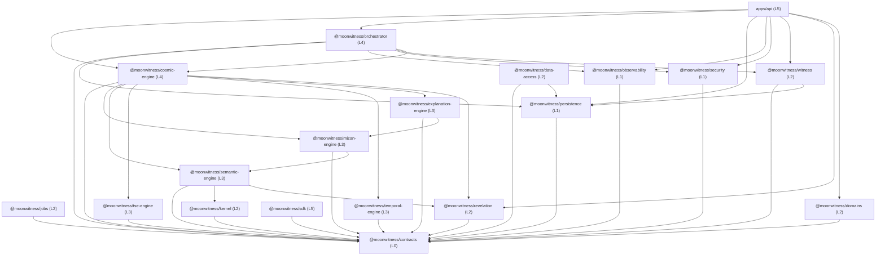

# Cosmic Architecture — Dependency Graph & Layer Hierarchy (Phase 3)

## 1. Architectural Layers & Invariant Rules

The platform strictly follows a 6-tier Directed Acyclic Graph (DAG):

1. **L0 — Contracts Layer**: Zero internal dependencies. Defines pure interfaces, schemas, and DTOs.
2. **L1 — Core Infrastructure**: Depends only on L0. Supplies database drivers, auth primitives, telemetry.
3. **L2 — Core Domain & Ledger**: Depends on L0, L1. Implements Witness QDAG, Revelation corpus, Knowledge Kernel, Background Jobs, Domain profiles.
4. **L3 — Capability Engines**: Depends on L0, L1, L2. Implements pure computational engines (TSE, Mizan, Semantic, Temporal, Explanation).
5. **L4 — Platform Orchestration & Facade**: Depends on L0–L3. Unifies engines under `createCosmicEngine()` and manages durable workflows.
6. **L5 — Consumption & Application Hosts**: Depends on L0–L4. SDK client and HTTP API server.

---

## 2. Mermaid Dependency Diagram

---

## 3. Dependency Matrix Verification

| From Package | To Allowed Layers | Disallowed Layers | Status |
| :--- | :--- | :--- | :--- |
| `packages/contracts` | None (Self-contained) | L1, L2, L3, L4, L5 | Verified Acyclic |
| `packages/persistence` | L0 | L2, L3, L4, L5 | Verified Acyclic |
| `packages/observability` | L0 | L2, L3, L4, L5 | Verified Acyclic |
| `packages/security` | L0 | L2, L3, L4, L5 | Verified Acyclic |
| `packages/domains` | L0 | L3, L4, L5 | Verified Acyclic |
| `packages/witness` | L0, L1 | L3, L4, L5 | Verified Acyclic |
| `packages/jobs` | L0 | L3, L4, L5 | Verified Acyclic |
| `packages/kernel` | L0 | L3, L4, L5 | Verified Acyclic |
| `packages/revelation` | L0 | L3, L4, L5 | Verified Acyclic |
| `packages/mizan-engine` | L0, L2 | L4, L5 | Verified Acyclic |
| `packages/tse-engine` | L0 | L4, L5 | Verified Acyclic |
| `packages/cosmic-engine`| L0, L1, L2, L3 | L5 | Verified Acyclic |
| `packages/orchestrator` | L0, L1, L2, L3, L4 | L5 | Verified Acyclic |
| `packages/sdk` | L0 | L1..L5 internal | Verified Acyclic |
| `apps/api` | L0, L1, L2, L3, L4 | None | Verified Host Root |
